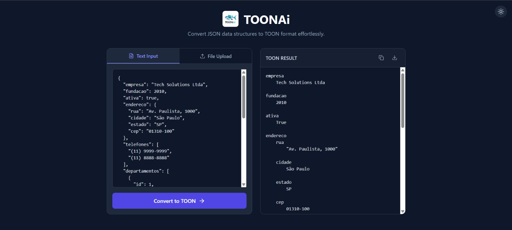

# TOONAi 🐟⚙️

**TOONAi** é uma aplicação web que converte estruturas de dados em **JSON** para o formato **TOON**, de forma simples, rápida e visual.

O projeto foi pensado para facilitar a transformação de grandes volumes de dados JSON em um formato mais compacto, estruturado e eficiente, especialmente útil em cenários envolvendo **IA, LLMs, redução de tokens e padronização de dados**.

---

## 🚀 Funcionalidades

- 🔁 Conversão de **JSON → TOON**
- 📝 Entrada de dados via **texto**
- 📂 Upload de arquivos JSON
- 📤 Geração do resultado em formato TOON
- 📋 Copiar resultado com um clique
- 💾 Download do arquivo `.toon`
- 🌗 Suporte a **tema claro e escuro**
- ⚡ Interface rápida e responsiva

---

## 🖥️ Interface

A interface foi construída com foco em **usabilidade, clareza e produtividade**, contando com:

- Editor de entrada em JSON
- Área de visualização do resultado TOON
- Feedback visual claro para ações do usuário
- Layout responsivo (desktop e mobile)

O front-end utiliza um design moderno baseado em **TailwindCSS**, com componentes bem definidos e acessíveis.

  

---

## 🧱 Tecnologias Utilizadas

### Front-end
- **React**
- **TypeScript**
- **Vite**
- **Tailwind CSS**
- **Lucide Icons**

### Back-end
- Lógica de conversão JSON → TOON
- Estrutura preparada para futuras integrações com:
  - APIs
  - LLMs
  - Pipelines de IA
  - Serviços de compressão e validação
